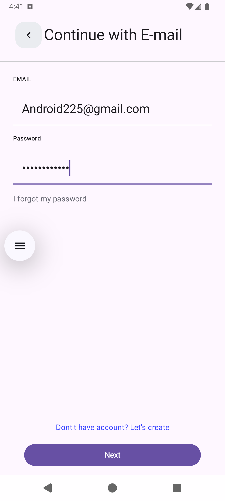
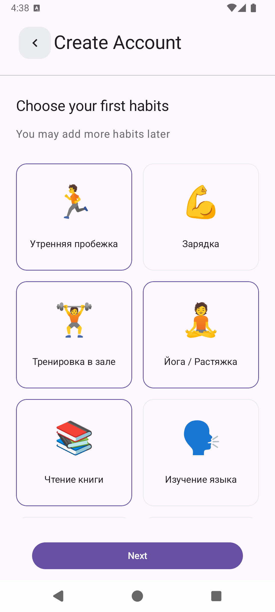
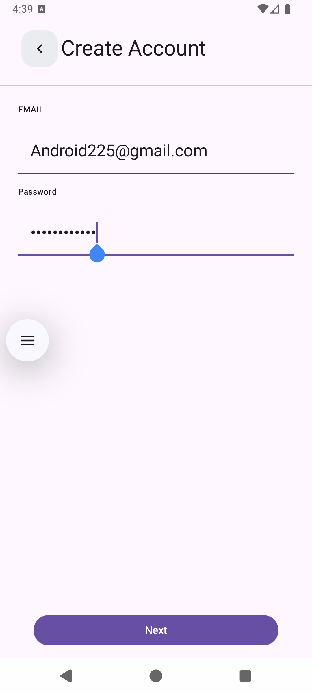
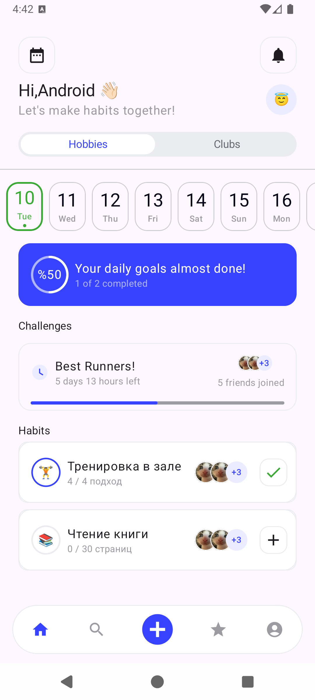
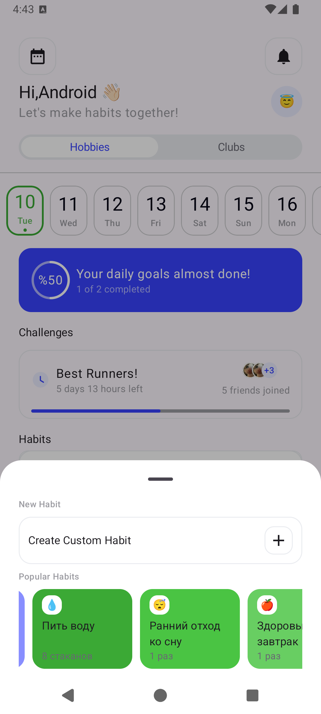
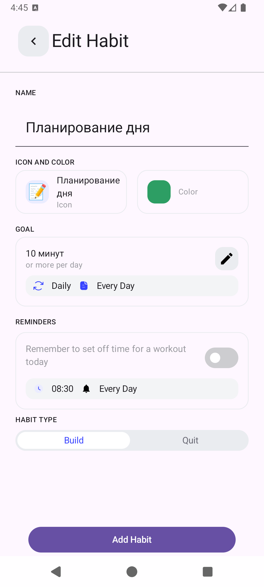
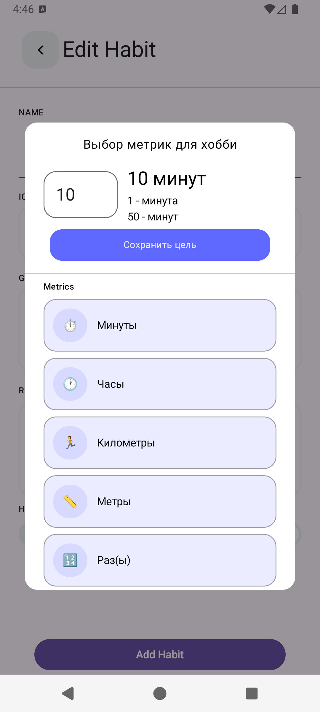
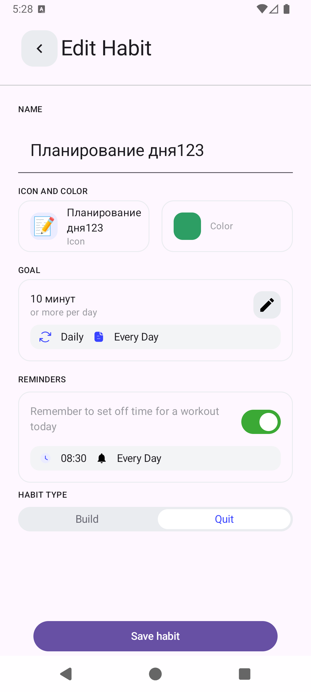

#  HabitTracker | Production-Ready Android Application

Современное приложение для трекинга привычек на Kotlin с Clean Architecture, Jetpack Compose и современным Android стеком.

##  Возможности
###  Аутентификация и синхронизация данных
- **Firebase Authentication** с email/паролем
- **Гибридное хранение данных**: Room (оффлайн) + Firebase Firestore (облачная синхронизация)
- **Синхронизация данных** с обработкой конфликтов
- **Слой мапперов** между data/domain/presentation моделями

###  Современный Android стек
- **Jetpack Compose** для декларативного UI
- **Clean Architecture** с 14+ UseCases
- **Coroutines & Flow** для асинхронных операций
- **Dependency Injection** через Hilt
- **Material Design 3** система темизации

###  Основной функционал
- **Создание привычек** с кастомными метриками, расписанием, цветами и иконками
- **Отслеживание прогресса** с визуальными индикаторами
- **Свайп-действия** для быстрого выполнения/пропуска/провала привычек
- **Календарный вид** для истории привычек
- **Многоэтапная регистрация** с сохранением состояния
- **Редактирование прогресса в реальном времени**

##  Архитектура
Проект построен по принципу **Clean Architecture**:

### **1. Data слой (данные)**
- **Room** - локальная база данных на устройстве
- **Firebase Firestore** - облачное хранение и синхронизация
- **Мапперы** - преобразуют данные между разными форматами

### **2. Domain слой (бизнес-логика)**
- **14+ UseCase классов** - каждый отвечает за одну операцию
- Примеры: `AddHabitUseCase`, `EditHabitUseCase`, `GetHabitsUseCase`
- Содержит правила: "какую привычку показывать сегодня", "как считать прогресс"

### **3. Presentation слой (показ)**
- **Jetpack Compose** - современный UI фреймворк
- **ViewModel** - хранит состояние экрана
- **State/Event паттерн** - управление состоянием UI

## 📸 Скриншоты

| Авторизация | Регистрация | Главный экран | Создание привычки | Редактирование привычки |
|-------------|-------------|---------------|-------------------|-------------------------|
|  |   |    |  | |

##  Запуск проекта

### Требования
- Android Studio Giraffe или новее
- Firebase проект с включёнными Authentication и Firestore

### Установка
1. Клонируйте репозиторий
2. Добавьте ваш `google-services.json` в папку `app/`
3. Соберите и запустите проект

##  Метрики проекта
- **6,000+ строк** кода на Kotlin
- **7+ интерактивных экранов**
- **14+ UseCases** в Clean Architecture
- **2 источника данных** (Room + Firebase)
- **100% Kotlin** с современными Coroutines/Flow

##  О разработчике

**Проект демонстрирует навыки:**
- Современной Android разработке на Jetpack Compose
- Clean Architecture и SOLID принципах
- Сохранении и синхронизации данных
- Реализации сложного UI
---
